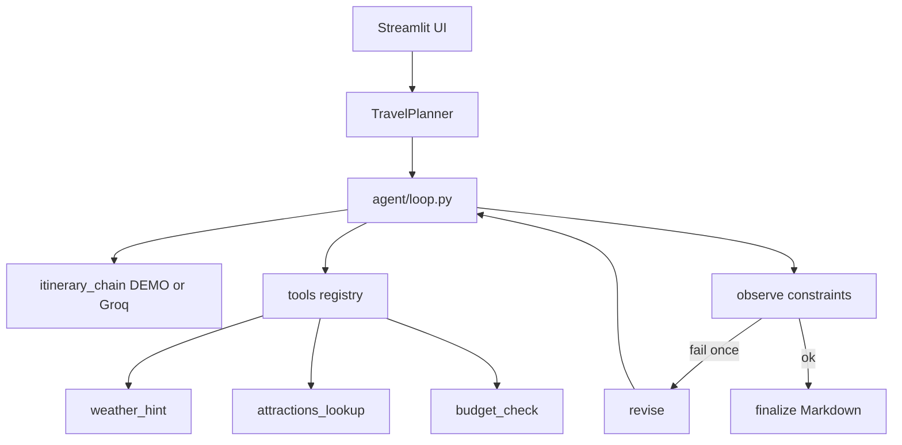
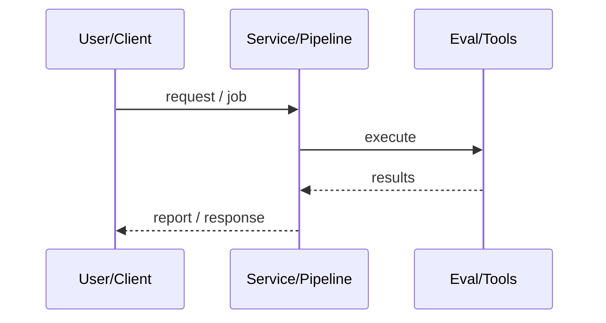
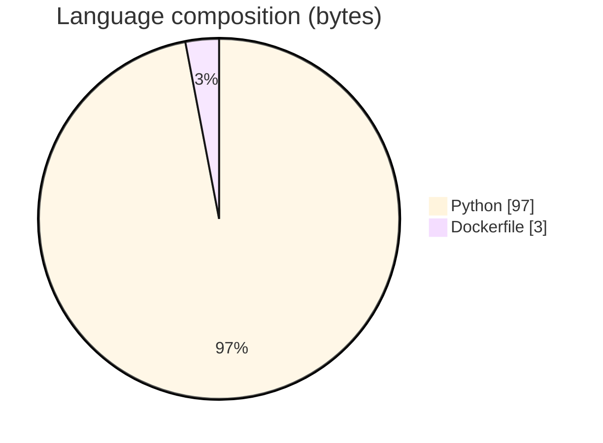

# AI Travel Planning Agent

### Streamlit day-trip agent with a real plan→tools→observe→revise(≤1)→finalize loop, DEMO_MODE offline path, and Docker/K8s packaging.

[](https://github.com/ArchanaChetan07/AI-Travel-Planner)
[](https://github.com/ArchanaChetan07/AI-Travel-Planner)
[](https://github.com/ArchanaChetan07/AI-Travel-Planner)
[](https://github.com/ArchanaChetan07/AI-Travel-Planner/actions)

---

## Overview

Many “travel agents” are single LLM prompts without constraint tools, observation, or a hard revision budget.

TravelPlanner orchestrates `src/agent/loop.py` with tools `weather_hint`, `attractions_lookup`, `budget_check`; Groq Llama when keyed else DEMO templates; Streamlit UI; Dockerfile + k8s-deployment with HPA; pytest + ruff CI under DEMO_MODE.

End-to-end demoable planner that revises once on weather/budget failures and emits Markdown itineraries with an agent-checks audit trail.

This repository is maintained as **production-minded portfolio work**: clear architecture, automated checks where present, and metrics that are **traceable to committed artifacts** (never invented).

---

## Architecture

Streamlit app.py → TravelPlanner → agent loop (plan → tools → observe → revise? → finalize) → Markdown itinerary + audit checks





---

## Results & repository facts

> Only values found in code, configs, tests, or generated reports are listed. Absence of a clinical/ML accuracy number means it was **not** published in-repo.

| Metric | Value | Source |
|---|---|---|
| Tracked blobs on main | **27** | `git tree main` |
| Revision budget | **≤1** | `src/agent/loop.py / README.md` |
| Tracked files | **27** | `git tree` |
| Python modules | **20** | `git tree` |
| Test-related paths | **3** | `git tree` |
| CI workflows | **Yes** | `.github/workflows` |
| Docker present | **Yes** | `repo root` |



---

## Key features

- Explicit agent loop with max one revision
- Weather, attractions, and budget tools
- DEMO_MODE offline templates
- Streamlit input UX for city/interests/budget
- Kubernetes manifests with probes/HPA/non-root
- pytest + ruff CI

---

## Tech stack

| Layer | Technology |
|---|---|
| language | Python |
| ui | Streamlit |
| llm | Groq Llama (optional) |
| agent | custom tool loop |
| deploy | Docker + Kubernetes HPA |
| ci | GitHub Actions |

---

## Skills demonstrated

Python · Streamlit · Groq LLM (optional) · Docker · Kubernetes · pytest · CI/CD · testing · automation

Keyword surface: **Python · Python · machine-learning · CI/CD · testing · API · Docker · automation · data-science · software-engineering · system-design · observability · LLM · cloud**

---

## Project structure

```text
AI-Travel-Planner/
├── app.py
├── src/agent/loop.py
├── src/tools/registry.py
├── src/chains/itinerary_chain.py
├── src/core/planner.py
├── Dockerfile
├── k8s-deployment.yaml
└── tests/
```

---

## Installation & usage

```bash
git clone https://github.com/ArchanaChetan07/AI-Travel-Planner.git
cd AI-Travel-Planner
pip install -r requirements.txt
set DEMO_MODE=1
streamlit run app.py
```

---

## How it works

User submits destination constraints in Streamlit; the planner builds an initial day plan, calls tools, inspects weather/budget observations, optionally revises once, then finalizes a Markdown itinerary with a checklist of agent verifications.

---

## Future improvements

- Live weather/maps APIs beyond stubs
- Multi-day / multi-city planning
- Commit coverage.xml if advertising coverage % in metadata

---

## License

See repository.

---

<p align="center">
  <b>AI Travel Planning Agent</b><br/>
  <a href="https://github.com/ArchanaChetan07/AI-Travel-Planner">github.com/ArchanaChetan07/AI-Travel-Planner</a>
</p>
